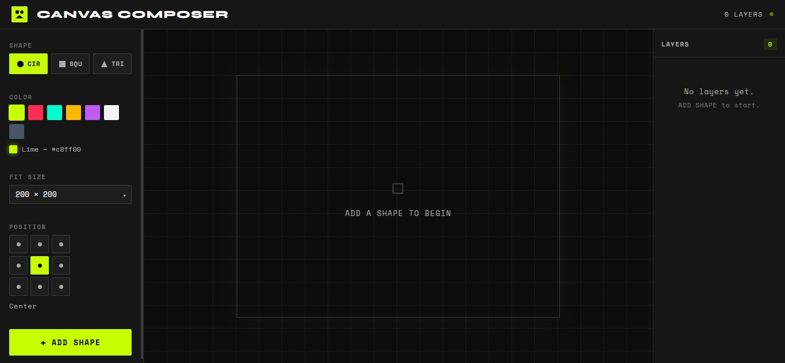

# Canvas Composer

A React + TypeScript canvas application for composing and managing shapes as distinct layers.

## Tech Stack

- **React 18** with TypeScript
- **Vite** (build tool / dev server)
- **HTML5 Canvas API** (no third-party canvas libraries)
- **CSS Modules** (no UI kits)

## Project Structure

```
canvas-app/
├── index.html
├── package.json
├── tsconfig.json
├── tsconfig.node.json
├── vite.config.ts
└── src/
    ├── main.tsx              # App entry point
    ├── App.tsx               # Root component
    ├── App.module.css
    ├── index.css             # Global reset
    ├── types/
    │   └── index.ts          # All TypeScript types
    ├── constants/
    │   └── index.ts          # Shapes, colors, sizes, positions
    ├── hooks/
    │   ├── useLayers.ts      # Layer state management
    │   └── useCanvas.ts      # Canvas ref + redraw effect
    ├── utils/
    │   └── canvas.ts         # Canvas drawing logic
    └── components/
        ├── Controls.tsx      # Left control panel
        ├── Controls.module.css
        ├── ControlGroup.tsx  # Label + input wrapper
        ├── ControlGroup.module.css
        ├── Select.tsx        # Generic select dropdown
        ├── Select.module.css
        ├── CanvasView.tsx    # Canvas element
        ├── CanvasView.module.css
        ├── LayerPanel.tsx    # Right layers list
        ├── LayerPanel.module.css
        ├── LayerItem.tsx     # Individual layer row
        └── LayerItem.module.css
```

## Setup & Running Locally

### Prerequisites
- **Node.js** v18 or higher ([download](https://nodejs.org))
- **npm** v9 or higher (comes with Node)

### Steps

```bash
# 1. Clone the repository
git clone https://github.com/vasukurdia/canvas-composer.git
cd canvas-composer

# 2. Install dependencies
npm install

# 3. Start the development server
npm run dev
```

Then open **http://localhost:5173** in your browser.

### Other Commands

```bash
npm run build    # Type-check + production build → ./dist
npm run preview  # Preview production build locally
npm run lint     # Run ESLint
```

## Features

- **3 Shape types**: Circle, Square, Isosceles Triangle
  - Triangle is mathematically centred (by centroid) within its bounding box
- **7 Colors**: Black, Red, Blue, Green, Orange, Purple, White
- **3 Size Fits**: 100×100, 200×200, 400×400 px
- **9-point Alignment**: Top-Left, Top-Center, Top-Right, Middle-Left, Center, Middle-Right, Bottom-Left, Bottom-Center, Bottom-Right
- **Layer management**: New shapes stack on top; each layer can be individually deleted
- **Performant redraw**: Canvas redraws only when the layers array changes

## 📸 Screenshots

### 🔹 Home Page
